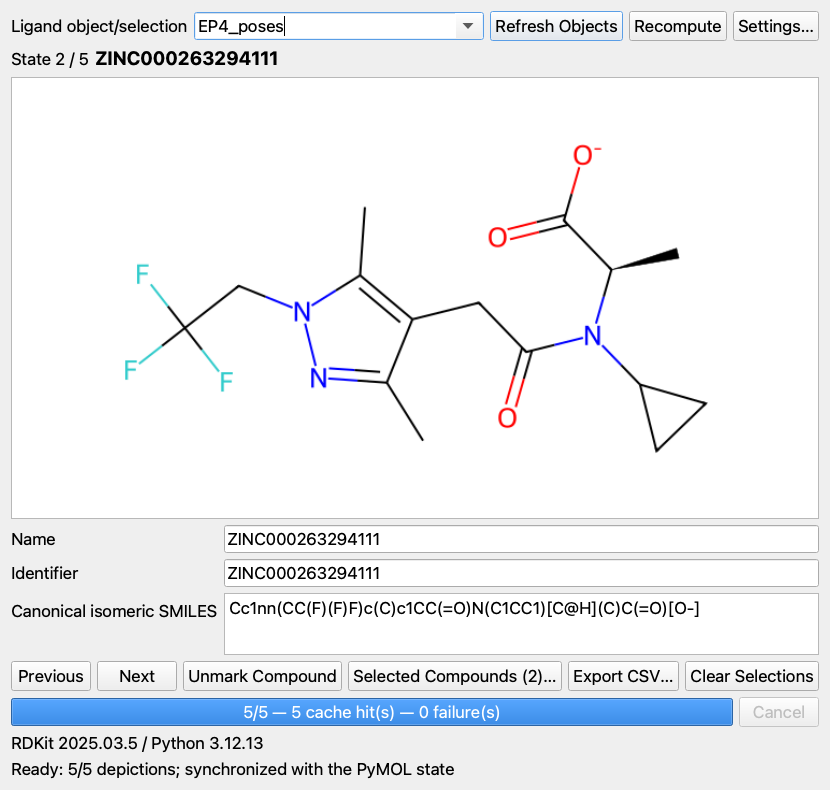
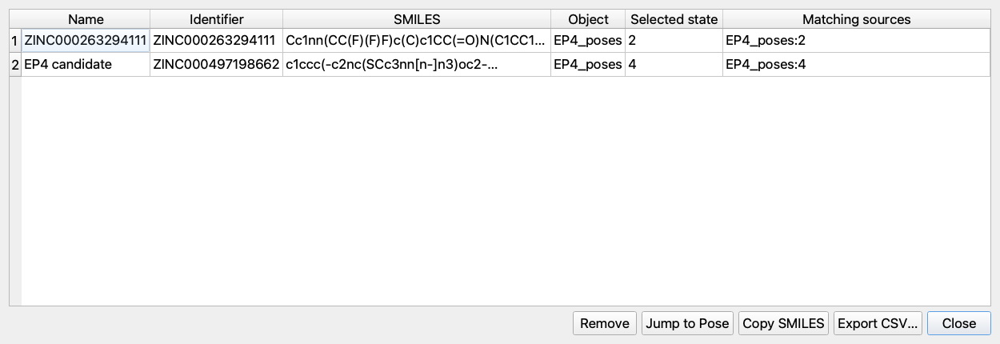

# PyMOL Ligand Review Panel

Ligand Review Panel is a PyMOL 2.5+/Qt5 companion for docking-pose triage. It
shows an RDKit 2D structure and compound title for the current state of a
multi-state ligand object, follows PyMOL state changes automatically, and
exports marked compounds to CSV.

The plugin is independently useful, and PLIP Pose Inspector 0.4+ can open it
directly with **2D Review…**. PyMOL's `load_png` displays a static image in the
molecular viewport; it is not a persistent concurrent overlay, so this plugin
uses a nonmodal Qt window beside the 3D view.

## Features

- State-synchronized 600×400 RDKit depictions with no perceptible warm-state
  delay.
- Canonical isomeric SMILES, cleaned PyMOL state title, and editable Name and
  Identifier fields.
- Background precomputation in an external RDKit process, keeping binary
  dependencies out of PyMOL.
- Persistent depiction cache with current-state-first streaming, cancellation,
  diagnostics, and per-state failures.
- Compound-level marking deduplicated by original identifier and canonical
  SMILES.
- Session worklist with editable review table, jump-to-pose, SMILES copy, and
  atomic UTF-8 CSV export.
- Original ligand objects and representations remain untouched.





## Environment

Create the isolated worker environment once:

```bash
conda env create -f environment.yml
```

The plugin auto-detects
`~/miniconda3/envs/pymol-ligand-review/bin/python`. A different interpreter can
be configured and health-checked under **Settings…**. PyMOL 3.1 installations
that already contain RDKit can use their interpreter as an external-process
fallback. The plugin never installs or upgrades dependencies at startup.

## Install

Build the Plugin Manager archive:

```bash
python3 scripts/build_plugin_zip.py
```

In PyMOL, choose **Plugin → Plugin Manager → Install New Plugin** and select
`dist/PyMOL_Ligand_Review-0.1.0.zip`. Open **Plugin → Ligand Review Panel**.

PLIP integration requires PLIP Pose Inspector 0.4.0 or newer. The plugins use
separate ZIPs and environments; neither package imports the other's worker
dependencies.

## Workflow

1. Load a ligand object whose PyMOL states are docking poses or compounds.
2. Open Ligand Review Panel and select that object. All states begin depicting
   automatically, with the current state first.
3. Continue changing state with PyMOL's arrows or the panel's Previous/Next
   buttons. The title, depiction, metadata, and selected status follow.
4. Edit Name or Identifier if desired, then press **Mark Compound**.
5. Use **Selected Compounds…** to edit, remove, copy, or jump back to a pose.
6. Export the worklist as CSV.

PyMOL does not expose arbitrary SDF property fields after loading. Name and
Identifier therefore default to the cleaned state title. The molecular graph,
bond orders, formal charges, and stereochemistry are taken from PyMOL's SDF
export and interpreted by RDKit.

Selections remain in memory while the current PyMOL process is running. They
are not embedded in PSE files and are written to disk only by explicit CSV
export. Depiction images are cached automatically.

## Commands

```pml
ligand_review_gui ligand=poses
ligand_review_attach poses
ligand_review_mark enabled=toggle
ligand_review_mark enabled=on, name=Candidate 7, identifier=ZINC000000000007
ligand_review_export selected_compounds.csv
ligand_review_clear
```

From PLIP Pose Inspector:

```pml
plip_2d
plip_2d ligand=poses
```

## CSV contract

Rows are emitted in selection order with these columns:

`name, identifier, smiles, ligand_object, selected_state, matching_sources, selected_at_utc`

Multiple poses with the same cleaned original identifier and canonical
isomeric SMILES produce one compound row. `matching_sources` records every
matching `object:state` discovered during the session.

## Beta demo

With this repository beside `plip_plugin`, start PyMOL and run:

```pml
@demos/ep4_first5.pml
```

See [Beta feedback](docs/BETA_FEEDBACK.md) for the review checklist and
[Architecture](docs/ARCHITECTURE.md) for process and cache contracts.

The supplied 118-pose EP4 set completed in 2.8/1.6 seconds cold/warm under
PyMOL 2.5 and 2.1/1.2 seconds under PyMOL 3.1 on the local Apple Silicon test
machine. Warm timing includes parsing all states and resolving cached PNGs;
subsequent state switching itself is worker-free.
