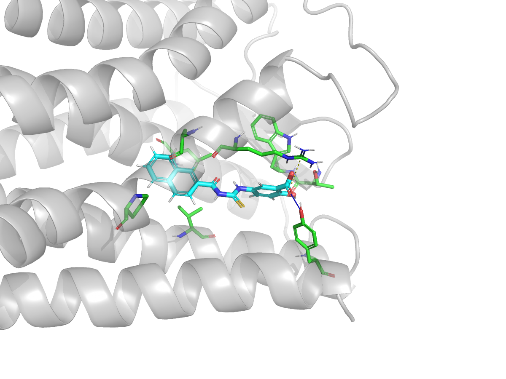

# PLIP Pose Inspector for PyMOL

PLIP Pose Inspector is a nonmodal PyMOL 2.5+/Qt5 plugin for reviewing
protein–ligand contacts across a multi-state docking object. It runs PLIP in a
separate conda environment, caches every pose independently, and renders one
state-aligned CGO object per interaction class. PyMOL's ordinary state arrows
therefore change both the ligand pose and its contacts immediately.

The current release is an Apple Silicon beta tested against the local PyMOL
2.5.0 and 3.1.0 installations in this workspace.


## Features

- Precompute all ligand states or analyze only the current state.
- Persistent, content-addressed, compressed per-pose cache.
- Hydrogen bonds, PLIP hydrophobic contacts, halogen bonds, water bridges,
  salt bridges, parallel and T-shaped pi stacking, pi-cation contacts, and
  metal coordination.
- Independent visibility controls for every class; hydrophobic contacts start
  hidden to reduce clutter.
- Optional, plugin-owned sticks view of the current interacting receptor
  residues.
- Original receptor and ligand objects and their representations are not
  modified.
- Scriptable `plip_gui`, `plip_analyze`, `plip_toggle`, and `plip_clear`
  commands.

## Install

Create the external worker environment once:

```bash
/Users/lkv206/miniconda3/bin/conda env create -f environment.yml
```

Build the Plugin Manager archive:

```bash
python3 scripts/build_plugin_zip.py
```

In PyMOL, open **Plugin → Plugin Manager → Install New Plugin**, select
`dist/PLIP_Pose_Inspector-0.1.0.zip`, then open **Plugin → PLIP Pose
Inspector**. The plugin auto-detects
`~/miniconda3/envs/pymol-plip-plugin/bin/python`; a different interpreter can
be selected and health-checked under **Settings**.

The plugin never installs or upgrades dependencies when PyMOL starts.

## Use

1. Load a receptor object and a ligand object whose states are docking poses.
2. Choose those objects in the dialog. The default receptor filter includes
   `polymer.protein or solvent or inorganic` within the chosen receptor.
3. Press **Precompute All**. Analysis occurs outside PyMOL and existing
   overlays remain visible until a complete or partially successful result is
   ready.
4. Use PyMOL's state arrows normally. Toggle interaction classes or the pocket
   at any time.

`Hydrophobic contacts` uses PLIP's geometric interaction definition; it is not
a generic all-atom van der Waals calculation.

Equivalent command-line use:

```pml
plip_gui
plip_analyze receptor, ligands, states=all
plip_analyze receptor, ligands, states=current, receptor_state=1
plip_toggle types=hbonds,salt, enabled=off
plip_toggle types=all, enabled=toggle
plip_clear
```

`plip_clear` deletes only namespaced objects owned by the plugin. Closing the
dialog leaves overlays and state synchronization active.

## EP4 beta demo

From this repository, start PyMOL and run:

```pml
@demos/ep4_first5.pml
```

The script loads the receptor and five supplied poses, opens the dialog, and
starts precomputation. See [Beta feedback](docs/BETA_FEEDBACK.md) for the short
review checklist. A precomputed PyMOL 2.5-compatible session is also available
at `demos/EP4_first5_beta.pse`.



## Tests

```bash
python3 -m unittest discover -s tests -v
/opt/local/bin/python3.11 -m unittest tests.test_rendering -v
/Users/lkv206/miniconda3/bin/conda run -n pymol_jupyter \
  python -m unittest tests.test_rendering -v
```

The first command covers serialization, cache invalidation, normalized
profiles, and error cases. The latter two validate explicit empty CGO states
and PSE persistence in PyMOL 2.5 and 3.1.

The supplied 118-pose integration run completed with 118/118 profiles and no
failures in 26.3 seconds cold and 0.61 seconds warm (98 MB peak PyMOL-process
RSS on this machine). All nine overlay objects contained 118 states, and 1,180
programmatic state changes completed in under a millisecond before GUI redraw.

## Attribution

Interaction perception is provided by [PLIP](https://github.com/pharmai/plip)
3.0.1 with OpenBabel 3.2.1. Please cite PLIP when publishing results generated
with this plugin. PLIP's established interaction colors and presentation were
used as the visual reference.

Implementation decisions and cache/profile schemas are documented in
[Architecture](docs/ARCHITECTURE.md).
