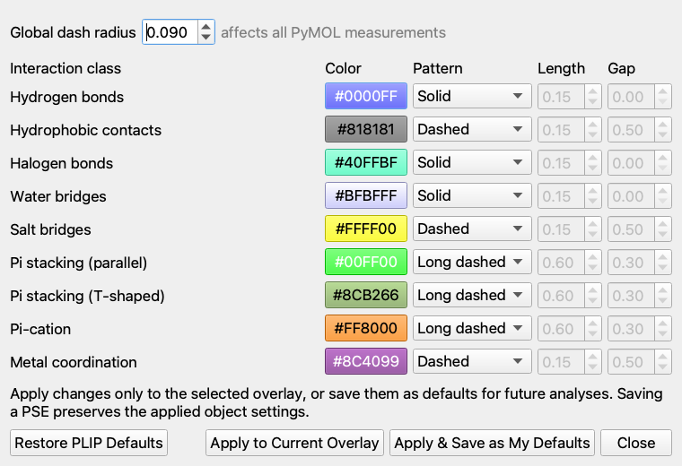

# PLIP Pose Inspector for PyMOL

PLIP Pose Inspector is a nonmodal PyMOL 2.5+/Qt5 plugin for reviewing
protein–ligand contacts across a multi-state docking object. It runs PLIP in a
separate conda environment, caches every pose independently, and renders one
state-aligned native measurement object per interaction class. PyMOL's ordinary
state arrows therefore change both the ligand pose and its contacts immediately.

The current release is an Apple Silicon beta tested against the local PyMOL
2.5.0 and 3.1.0 installations in this workspace.


## Features

- Precompute all ligand states or analyze only the current state.
- Persistent, content-addressed, compressed per-pose cache.
- Hydrogen bonds, PLIP hydrophobic contacts, halogen bonds, water bridges,
  salt bridges, parallel and T-shaped pi stacking, pi-cation contacts, and
  metal coordination.
- Independent visibility controls for every class; hydrophobic contacts start
  hidden to reduce clutter.
- A plugin-owned pocket can show residues for the current pose, the union from
  all analyzed poses, or remain hidden. Its geometry is state-aligned and
  survives saving and reopening a PSE. Both geometries are prebuilt, so mode
  changes never rerun PLIP.
- Native measurement objects inherit PyMOL's global `dash_radius`, while PLIP
  colors and class-specific dash length/gap settings remain object-local.
- The Appearance dialog provides per-class RGB colors and solid, dashed,
  long-dashed, or custom patterns. Apply styles to one overlay or save them as
  defaults for future analyses.
- Captured PLIP diagnostics are directly viewable and copyable for the current
  pose.
- Original receptor and ligand objects and their representations are not
  modified.
- Scriptable `plip_gui`, `plip_analyze`, `plip_toggle`, `plip_pocket`, and
  `plip_clear` commands, plus an optional `plip_2d` bridge to Ligand Review
  Panel.

## Install

Create the external worker environment once:

```bash
/Users/lkv206/miniconda3/bin/conda env create -f environment.yml
```

Build the Plugin Manager archive:

```bash
python3 scripts/build_plugin_zip.py
```

In PyMOL, open **Plugin → Plugin Manager → Install New Plugin**, select
`dist/PLIP_Pose_Inspector-0.4.0.zip`, then open **Plugin → PLIP Pose
Inspector**. The plugin auto-detects
`~/miniconda3/envs/pymol-plip-plugin/bin/python`; a different interpreter can
be selected and health-checked under **Settings**.

The plugin never installs or upgrades dependencies when PyMOL starts.

## Use

1. Load a receptor object and a ligand object whose states are docking poses.
2. Choose those objects in the dialog. The default receptor filter includes
   `polymer.protein or solvent or inorganic` within the chosen receptor.
3. Press **Precompute All**. Analysis occurs outside PyMOL and existing
   overlays remain visible until a complete or partially successful result is
   ready.
4. Use PyMOL's state arrows normally. Toggle interaction classes or choose
   **Current pose**, **All analyzed poses**, or **Hidden** for the pocket.

Opening the dialog on a saved PSE automatically attaches to its existing PLIP
objects. Pocket, visibility, and appearance controls remain available without
normalized profiles or a worker run; counts, hydrogen details, and diagnostics
are marked unavailable until a live analysis supplies profiles.

**Analyze Current Only** is useful for a quick one-pose check. It still creates
empty overlay and pocket states elsewhere, and later analyses of the same
objects merge into the run. **Refresh Object Lists** rescans molecular objects
that were loaded, deleted, or renamed while the dialog was open; this also
happens automatically whenever the dialog is shown.

`Hydrophobic contacts` uses PLIP's geometric interaction definition; it is not
a generic all-atom van der Waals calculation.

Equivalent command-line use:

```pml
plip_gui
plip_analyze receptor, ligands, states=all, pocket=current
plip_analyze receptor, ligands, states=current, receptor_state=1, pocket=all
plip_toggle types=hbonds,salt, enabled=off
plip_toggle types=all, enabled=toggle
plip_pocket mode=current, ligand=ligands
plip_pocket mode=all
plip_pocket mode=off
plip_2d
plip_2d ligand=ligands
plip_clear
```

For native dash styling, normal PyMOL commands now work immediately:

```pml
set dash_radius, .09
set dash_gap, .25, PLIP_Pose_Inspector_*_Hydrophobic_contacts
```

The plugin never changes the global dash radius during ordinary analysis.
`pocket=1` and `pocket=0` remain aliases for `current` and `off`.

Use **Appearance…** for per-class colors and line patterns. **Apply to Current
Overlay** remains project-local and persists when that PSE is saved. **Apply &
Save as My Defaults** affects subsequent analyses, while **Restore PLIP
Defaults** clears the saved class preferences. Global radius remains a PyMOL
session/project setting because it also affects unrelated measurements.

`plip_clear` deletes only namespaced objects owned by the plugin. Closing the
dialog leaves overlays and state synchronization active.

## Optional 2D ligand review

PLIP Pose Inspector 0.4 adds **2D Review…**, which opens the separately
installed **Ligand Review Panel** on the current ligand selector. The companion
uses an external RDKit process to show the current state's 2D structure and
canonical SMILES, mark compounds, and export a compound-level CSV worklist.
Both windows follow PyMOL's global state independently, so either can remain
open or be hidden without affecting the other.

Install the companion's Plugin Manager ZIP and RDKit environment before using
this action. If it is absent, PLIP reports installation guidance and all
interaction-analysis functionality remains available.

## EP4 beta demo

From this repository, start PyMOL and run:

```pml
@demos/ep4_first5.pml
```

The script loads the receptor and five supplied poses, opens the dialog, and
starts precomputation. See [Beta feedback](docs/BETA_FEEDBACK.md) for the short
review checklist. A precomputed PyMOL 2.5-compatible session is also available
at `demos/EP4_first5_beta.pse`.




Reference inputs and legacy PLIP webserver outputs live under `fixtures/`:
`fixtures/ep4/`, `fixtures/ep4/webserver/`, and `fixtures/2rh1/`.

## Tests

```bash
python3 -m unittest discover -s tests -v
/opt/local/bin/python3.11 -m unittest tests.test_rendering -v
/Users/lkv206/miniconda3/bin/conda run -n pymol_jupyter \
  python -m unittest tests.test_rendering -v
```

The first command covers serialization, cache invalidation, normalized
profiles, dialog geometry, and error cases. The latter two validate native
measurement colors/settings, explicit empty states, pocket modes, and PSE
persistence in PyMOL 2.5 and 3.1.

The Beta 0.3 supplied 118-pose integration completed with 118/118 profiles and
no failures in both PyMOL versions. PyMOL 2.5 took 26.8 seconds cold and 2.5
seconds warm (approximately 95 MiB peak RSS); PyMOL 3.1 took 25.4 seconds cold
and 2.3 seconds warm (approximately 129 MiB peak RSS). Warm timing includes
rebuilding every state-aligned native object from 118 cache hits. State and
pocket switching itself remains immediate and does not launch the worker.

## Attribution

Interaction perception is provided by [PLIP](https://github.com/pharmai/plip)
3.0.1 with OpenBabel 3.2.1. The plugin presents the PLIP authors' recommended
2021 and 2015 citations on first use and from the permanent **Citation…**
button. PLIP's established interaction colors and presentation remain the
initial defaults.

Implementation decisions and cache/profile schemas are documented in
[Architecture](docs/ARCHITECTURE.md).
