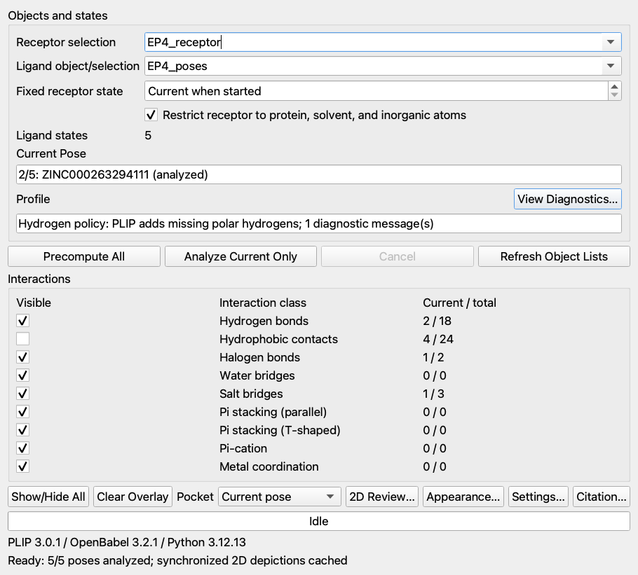

# PyMOL Pose Inspector

PyMOL Pose Inspector is a nonmodal PyMOL 2.5+/Qt5 plugin for docking-pose
triage. It combines state-aligned PLIP protein–ligand interactions with an
RDKit 2D structure viewer, canonical SMILES, compound marking, and CSV export.
Both views follow the same multi-state ligand object and PyMOL state.

The current Apple Silicon beta is tested with the local PyMOL 2.5.0 and 3.1.0
installations in this workspace.




## Features

- Precompute PLIP contacts for all ligand states or analyze only the current
  pose, with persistent per-pose caching and independent cancellation.
- Native, state-aligned PyMOL measurement objects for nine PLIP interaction
  classes. PyMOL's state arrows switch ligand and interactions immediately.
- Current-pose, all-analyzed, or hidden interacting-residue pockets that
  survive PSE save/reopen without recomputation.
- Project-local and saved-default interaction colors and dash patterns, while
  normal PyMOL `dash_radius` behavior remains intact.
- A detachable 600×400 RDKit depiction, canonical isomeric SMILES, editable
  compound metadata, Previous/Next navigation, compound marking, and atomic
  UTF-8 CSV export.
- One shared ligand selection, state watcher, settings dialog, external Python
  environment, and Plugin menu entry.
- Original receptor and ligand objects, chemistry, and representations remain
  untouched.

## Install

Create the unified external environment once:

```bash
/Users/lkv206/miniconda3/bin/conda env create -f environment.yml
```

Build the reproducible Plugin Manager archive:

```bash
python3 scripts/build_plugin_zip.py
```

In PyMOL, open **Plugin → Plugin Manager → Install New Plugin**, select
`dist/PyMOL_Pose_Inspector-0.5.0.zip`, then open
**Plugin → PyMOL Pose Inspector**. The plugin auto-detects
`~/miniconda3/envs/pymol-pose-inspector/bin/python`. A different interpreter
can be selected under **Settings…**, where PLIP, OpenBabel, RDKit, and Python
are health-checked together.

The plugin never installs, updates, or removes environments at PyMOL startup.
The retired standalone Ligand Review Panel 0.1 plugin should be removed after
upgrading; all of its commands and the detachable 2D window are included here.

## Workflow

1. Load a receptor and a ligand object whose states are docking poses or
   compounds.
2. Select both objects and press **Precompute All**. PLIP analysis and RDKit
   depiction generation run outside PyMOL in independent background processes.
3. Change states with PyMOL's arrows, `cmd.frame`, or the 2D panel's
   Previous/Next controls. Contacts, pockets, title, depiction, and SMILES stay
   synchronized.
4. Use **2D Review…** to inspect structures. Edit Name or Identifier and press
   **Mark Compound** for candidates of interest.
5. Review marked compounds, jump back to their poses, copy SMILES, and export
   the worklist to CSV.

RDKit depictions are cached by canonical isomeric SMILES and engine/drawing
version. PLIP profiles remain cached by receptor and pose chemistry, analysis
settings, and engine versions. The caches keep their pre-0.5 locations and
formats, so upgrading does not discard prior work.

Selections are intentionally session-only. Closing and reopening either window
retains them while PyMOL is running; exiting PyMOL clears them unless they were
exported.

## Commands

```pml
pose_inspector_gui
plip_gui
plip_analyze receptor, poses, states=all, pocket=current
plip_analyze receptor, poses, states=current, receptor_state=1, pocket=all
plip_toggle types=hbonds,salt, enabled=off
plip_pocket mode=all
plip_2d
plip_clear

ligand_review_gui ligand=poses
ligand_review_attach poses
ligand_review_mark enabled=on, name=Candidate 7, identifier=ZINC000000000007
ligand_review_export selected_compounds.csv
ligand_review_clear
```

The legacy `plip_*` and `ligand_review_*` contracts remain supported. Python
code importing `pymol_ligand_review` is forwarded to the integrated
implementation.

For native dash styling:

```pml
set dash_radius, .09
set dash_gap, .25, PLIP_Pose_Inspector_*_Hydrophobic_contacts
```

PLIP's hydrophobic contacts are its geometric interaction category, not a
generic all-atom van der Waals calculation.

## CSV contract

Rows are emitted in selection order with these columns:

`name, identifier, smiles, ligand_object, selected_state, matching_sources, selected_at_utc`

Compounds are grouped by cleaned original state identifier plus canonical
isomeric SMILES. Editable export metadata does not change that stable identity.

## Demo and tests

From the repository root:

```pml
@demos/ep4_first5.pml
```

The precomputed interaction session remains at `demos/EP4_first5_beta.pse` and
retains the compatible `PLIP_Pose_Inspector_*` object namespace.

Run unit tests and the real combined five-pose workflow with:

```bash
QT_QPA_PLATFORM=offscreen /Users/lkv206/miniconda3/bin/conda run -n pymol_jupyter \
  python -m unittest discover -s tests -v
/Users/lkv206/miniconda3/bin/conda run -n pymol_jupyter \
  python tests/run_unified_integration.py --states 5
```

Reference fixtures and legacy PLIP webserver outputs live under
`fixtures/ep4/`, `fixtures/ep4/webserver/`, and `fixtures/2rh1/`.

## Attribution

Interaction perception is provided by
[PLIP](https://github.com/pharmai/plip) 3.0.1 with OpenBabel 3.2.1. The plugin
shows the PLIP authors' recommended 2021 and 2015 citations on first use and
from **Citation…**. 2D chemistry and depictions use
[RDKit](https://www.rdkit.org/) 2025.03.5. OpenBabel and RDKit attribution is
also available in the permanent documentation and unified health display.

See [Architecture](docs/ARCHITECTURE.md) for process, cache, PSE, and migration
contracts and [Beta feedback](docs/BETA_FEEDBACK.md) for the review checklist.
