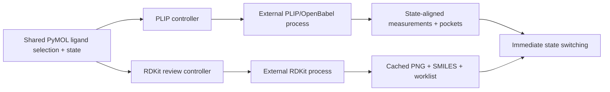

# Architecture

## Application and runtime boundaries

One long-lived application container owns the PyMOL command API, shared ligand
selection, one 125 ms state watcher, unified settings, both controllers, both
nonmodal dialogs, and the session-only compound worklist. The interaction
dialog and detachable 2D window can close independently without destroying
controllers or synchronization.

PLIP, OpenBabel, and RDKit are never imported into PyMOL. Two independent
`QProcess` jobs use the same validated `pymol-pose-inspector` Python 3.12
environment. Newline-delimited JSON streams results, failures, progress, and
completion. PLIP and RDKit can run concurrently and be cancelled independently.

A combined health check requires PLIP 3.0.1, OpenBabel 3.2.1, RDKit
2025.03.5, and reports the external Python version. Startup never mutates an
environment.

## Shared workspace contract

The active ligand selection must resolve to exactly one molecular object. A
selection change in either dialog updates the other and starts current-state-
first RDKit generation; it never silently starts PLIP. PLIP attaches compatible
saved overlays when present and otherwise waits for an explicit analysis
action. Object discovery excludes every `PLIP_Pose_Inspector_*` object.

The shared watcher emits only state/title changes. Native measurements and
state-aligned pocket objects perform all 3D switching inside PyMOL, while the
review controller selects an already-generated `QPixmap` and metadata record.

## PLIP export, cache, and rendering

- The receptor state is frozen when analysis starts; the default effective
  selection is `(user receptor) and (polymer.protein or solvent or inorganic)`.
- Ligand coordinates, elements, formal charges, explicit hydrogens, and integer
  bond orders are reconstructed without modifying the source object.
- A collision-checked synthetic `LIG` identity limits PLIP output to the
  requested ligand. Input hydrogens are used only when both partners contain
  them; otherwise PLIP adds missing polar hydrogens.
- Gzip JSON profile keys include schemas, engines, receptor and ligand
  chemistry, selection/state, target identity, and hydrogen policy. The legacy
  cache path and schemas remain unchanged.
- Nine native measurement objects always receive the ligand's full state
  count, including explicit empty states. PLIP colors and per-object dash
  patterns remain editable, and global `dash_radius` is inherited.
- `..._Pocket` contains each state's interacting residues plus a hidden
  sentinel; `..._Pocket_All` contains the union. Mode switching only changes
  enablement and survives PSE save/reopen.

Normalized profiles are not embedded in PSEs. Reattached sessions retain
geometry, visibility, pocket mode, and appearance while profile-only counts,
hydrogen details, and diagnostics are marked unavailable.

## RDKit export, cache, and selection

Each ligand state is exported independently as SDF without changing the source.
The active state is first in the manifest. RDKit sanitizes the graph, assigns
stereochemistry, removes explicit hydrogens for standard medicinal-chemistry
presentation, generates canonical isomeric SMILES, and draws a 600×400 Cairo
PNG. Invalid states fail independently and cannot be marked.

PNG keys contain canonical SMILES, RDKit and depiction schema versions,
dimensions, and drawing settings. The legacy depiction cache path and keys are
retained. Identical structures share a depiction.

The stable compound identity hashes the cleaned original PyMOL state title and
canonical isomeric SMILES. Editable Name and Identifier values are export
metadata only. Matching `object:state` sources accumulate in an ordered,
process-local worklist. CSV output uses Python CSV quoting and an atomic
same-directory replacement.

## Compatibility and ownership

The public package remains `pymol_plip`; the user-facing product is PyMOL Pose
Inspector. `pymol_ligand_review` is a forwarding facade. All `plip_*` and
`ligand_review_*` commands remain registered alongside `pose_inspector_gui`.
Only one Plugin menu item is added.

Existing `PLIP_Pose_Inspector_*` PSE object names, both cache locations, cache
schemas, appearance defaults, citation state, and CSV columns are preserved.
Legacy settings are read during first-run migration, but an old worker path is
accepted only when it passes the complete combined health check. The plugin
never deletes old environments or user molecular objects.

Cancelling PLIP preserves the previous overlay and completed cache entries.
Cancelling RDKit retains already-streamed depictions. Partial state failures are
reported independently in both workflows.
