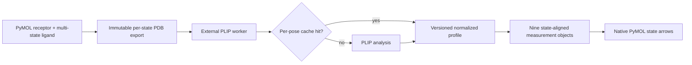

# Architecture notes

## Runtime boundary

PyMOL 2.5 and 3.1 use different embedded Python runtimes. Importing PLIP or
OpenBabel into either process risks binary and dependency conflicts. The plugin
therefore exports immutable analysis inputs and starts one `QProcess` using the
dedicated `pymol-plip-plugin` environment. Communication is newline-delimited
JSON; no PLIP object crosses the process boundary.

The worker requires exactly PLIP 3.0.1 and OpenBabel 3.2.1 or newer and reports
its Python and engine versions before analysis. Startup never mutates any
environment.

## Export contract

- The receptor state is frozen when analysis starts.
- The default effective selection is `(user receptor) and
  (polymer.protein or solvent or inorganic)`.
- Ligand coordinates, elements, formal charges, explicit hydrogens, and integer
  bond orders are reconstructed from `cmd.get_model` without touching the
  source object.
- Each requested pose is assigned a collision-checked synthetic `LIG` residue
  identity. The worker retains only that exact PLIP binding-site key, so
  unrelated cofactors in the receptor cannot leak into the requested profile.
- Input hydrogens are used only when both partners contain them. Otherwise PLIP
  adds missing polar hydrogens. The choice is stored in the profile and cache
  key.

PDB is used only as PLIP's process-boundary input. The loaded PyMOL chemistry is
the authoritative source; the supplied PLIP 2.4 XML/PSE files are presentation
references, not count fixtures.

## Profile schema

Each profile records:

- schema version, compound title, receptor and pose hashes;
- PLIP, OpenBabel, and Python versions;
- hydrogen policy and captured diagnostics;
- interacting receptor residues;
- typed edges with start/end coordinates and class-specific metadata.

The canonical classes are `hydrogen_bonds`, `hydrophobic_contacts`,
`halogen_bonds`, `water_bridges`, `salt_bridges`,
`pi_stacking_parallel`, `pi_stacking_t`, `pi_cation`, and
`metal_coordination`. A water bridge is represented by two connected edges so
the water position remains visible in the measurement geometry.

## Cache

The default macOS location is
`~/Library/Caches/PLIPPoseInspector`. Entries are gzip-compressed JSON and are
written atomically. Cache keys include:

- cache and profile schema versions;
- PLIP, OpenBabel, and worker Python versions;
- receptor atoms/connectivity and selected receptor expression/state;
- ligand atoms, coordinates, connectivity, formal charges, and hydrogens;
- target synthetic residue identity and hydrogen policy.

Changing any of these inputs causes an independent miss. Successful poses are
cached even when another state fails or the later run is cancelled.

## Rendering and ownership

One native PyMOL measurement object is created per interaction class. Every
object receives the ligand's complete state count. A zero-length measurement
in the final state is invisible but forces PyMOL to retain trailing and
intermediate empty states for missing, failed, or not-yet-analyzed poses. This
prevents a previous state's contacts from remaining visible and lets PyMOL
synchronize geometry natively without analysis or redraw callbacks.

Measurements use PLIP's established colors and class-specific dash length/gap
patterns. Their `dash_radius` object setting is deliberately unset, so they
inherit the user's global PyMOL setting like any user-created measurement.
Validated per-class appearance defaults are stored separately in `QSettings`;
applying them changes only native object settings and never interaction
geometry or cache keys.

All names begin with `PLIP_Pose_Inspector_` and live under a run group with
`Interactions` and `Structures` subgroups. Only these names are ever deleted.
Two pocket objects are materialized after analysis. `..._Pocket` is discrete:
each state holds exactly that profile's receptor residues plus a hidden
sentinel atom, which retains explicit empty and trailing states.
`..._Pocket_All` is a static one-state deduplicated residue union. Pocket mode
only enables one or disables both; geometry is never deleted or rebuilt during
switching. A fresh controller discovers namespaced measurement objects,
reattaches by ligand, infers mode from enablement, and can migrate a Beta 0.2
current-only pocket to a union using its residue identities and the selected
receptor—without PLIP.

Normalized profiles are intentionally not embedded in PSE files. Reattached
sessions retain geometry, interaction visibility, pocket modes, and appearance
settings, while counts, hydrogen policy, and diagnostic text are reported as
unavailable.

The 175 ms state watcher updates only dialog text and counts. It never rebuilds
or deletes molecular geometry. Closing the dialog does not destroy the
controller or watcher.

## Optional Ligand Review bridge

The **2D Review…** action and `plip_2d` command dynamically import the separate
`pymol_ligand_review` package and pass the current ligand selection. There is
no package-level dependency and no RDKit import in PLIP or PyMOL. Once opened,
the companion watches PyMOL's global state independently, while PLIP's native
measurement objects continue switching normally. A missing companion produces
installation guidance without affecting analysis or saved overlays.

## Failure and cancellation semantics

The current overlay stays intact while a worker runs. On partial completion,
successful state profiles render with explicit empty states for failures and
the UI reports each failed pose. Cancelling kills the worker, discards pending
UI results, preserves the previous overlay, and leaves already completed cache
entries available for the next run.
